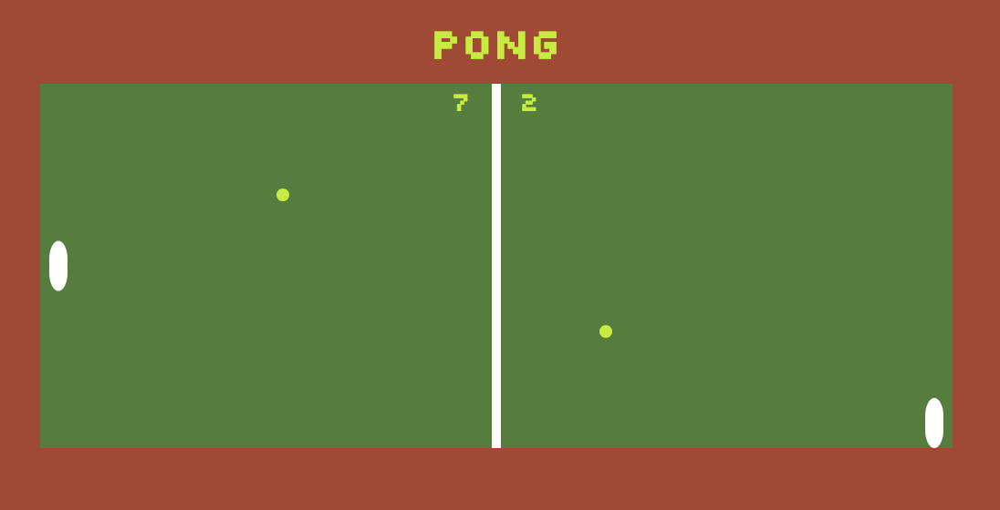

# Pong Game

This basic pong game built using SVGs, emulates the struggle that is outdoor tennis. In this version, the court is extended, balls sped up, and raquets rounded and decreased in size, just to make it a bit more challenging. May the calming park ambience soothe your headache.   

## Setup

**Install dependencies:**

`> npm i`

**Run locally with Webpack Dev Server:**

`> npm start`

**Build for production:**

`> npm run build`

## Keys

**Player 1:**
* a: up
* z: down

**Player 2:**
* ▲ : up
* ▼: down

**Pause:**
* spacebar

## Takeaways
Having a reputation for being a little too loose at times, Javascript, as demonstrated in this project, exhibits the power to provide structure while maintaining flexibility. While this is my first experience with Object Oriented Programming, I am astounded to learn just how limitless, versatile, and formidable Javascript can be.

## Built With

[VScode](http://www.vscode.com) - Text Editor

### ...and

* Html 5
* CSS
* SCSS
* JavaScript
* Webpack

## Author

Audra Kornicki - [Audrobot](https://github.com/Audrobot)

## Acknowledgments

Thank you to Jim Bennett, Rose Cass, and RED Academy for all the hardwork, support, and guidance.

